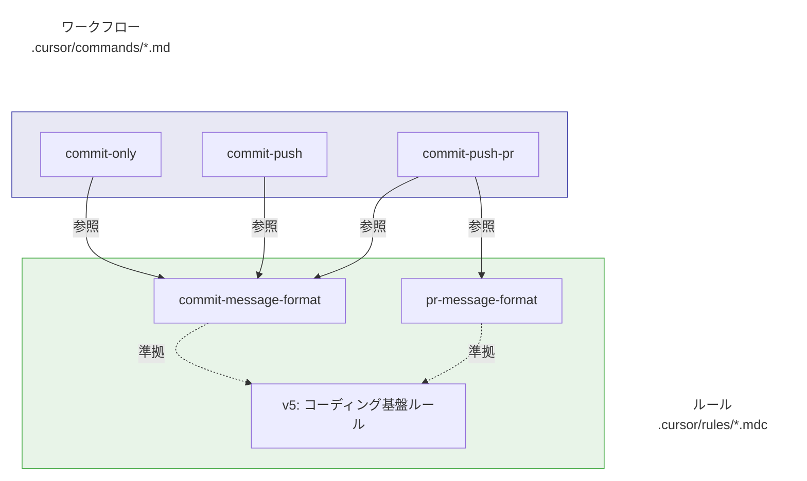
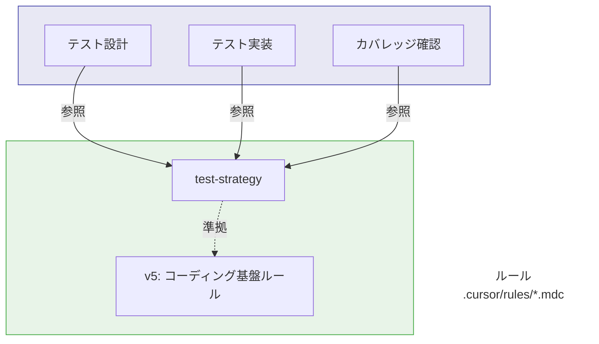

# ルールとワークフローの分離ガイド

このドキュメントでは、本リポジトリにおける **ルール（カスタムインストラクション）** と  
**ワークフロー（カスタムコマンド）** の役割分担と、効果的な使い方のベストプラクティスを整理します。

## 用語

- **ルール（Rules）**:  
  `.cursor/rules/*.mdc` に配置する、モデルが常に参照する「振る舞い・フォーマット」の規約。
  - 例: コミットメッセージ規約、PR メッセージ規約、テスト戦略ルールなど。
- **ワークフロー（Workflows）**:  
  `.cursor/commands/*.md` に配置する、よく使う Git 操作や開発フローをまとめたコマンドテンプレート。
  - 例: コミットのみ、コミット＆プッシュ、コミット＆プッシュ＆PR 作成など。

## 基本方針

1. **ルールは「何を・どう書くか」を定義する**  
   - メッセージフォーマット、必須セクション、禁止事項などをルール側で定義します。
   - 例:  
     - `commit-message-format.mdc` / `commit-message-format.en.mdc`: コミットメッセージの Prefix / サマリ / 箇条書き本文の書き方を定義。  
     - `pr-message-format.mdc` / `pr-message-format.en.mdc`: PR タイトル / 本文の構造（概要 / 変更内容 / テスト内容など）を定義。
     - `test-strategy.mdc` / `test-strategy.en.mdc`: テスト観点表、Given/When/Then コメント、カバレッジ方針などを定義。

2. **ワークフローは「どう実行するか」だけを書く**  
   - 実際に使う Git コマンドや、lint/test/build の呼び出し例をワークフロー側にまとめます。
   - ただし、メッセージやテストの「中身（書き方）」には踏み込まず、**ルールファイルへの参照**にとどめます。
   - 例:  
     - `commit-only.md`: コミットだけを行う手順（`git add -A` → `git commit -m "$MSG"`）と、  
       メッセージの中身は `commit-message-format.mdc` に従うことを明記。  
     - `commit-push.md`: ブランチチェック + 任意の品質チェック + `git push` までの流れを定義。  
     - `commit-push-pr.md`: コミット & プッシュ後に AI や `gh` コマンドで PR を作成するまでのテンプレート。

3. **プロジェクト固有のポリシーはルール側か README 側で明示する**  
   - 例: 「main 直コミット禁止」「PR タイトルの Prefix 一覧」「PR メッセージの必須セクション」など。
   - ワークフロー側には、あくまで「例」として最小限のロジックを記載し、  
     詳細な規約はルールファイルまたは README / CONTRIBUTING に書きます。

## ルールファイルの例

- `commit-message-format.mdc` / `commit-message-format.en.mdc`
  - コミットメッセージの基本フォーマット（Prefix + サマリ + 箇条書き本文）
  - 言語指定（`language = "ja"`）と、それに従うサマリ/本文の書き方
  - 未コミット差分に基づいてメッセージを生成すること
  - 曖昧なサマリや、意味のない変更のみのコミットの禁止

- `pr-message-format.mdc` / `pr-message-format.en.mdc`
  - PR タイトル（`<Prefix>: <サマリ>`）の書き方
  - 本文の構造（概要 / 変更内容 / 技術的な詳細 / テスト内容 / 関連 Issue）
  - 実際の差分・コミット履歴・Issue を入力にしたメッセージ生成の原則
  - 非構造な長文や曖昧なタイトルの禁止

- `test-strategy.mdc` / `test-strategy.en.mdc`
  - テスト観点表（等価分割・境界値）の作成
  - Given / When / Then コメントの必須化
  - 例外・エラー検証、カバレッジ取得方法のルール化

## ワークフローコマンドの例

- `commit-only.md`
  - ローカル変更をコミットだけ行う最小限のフロー。
  - コミットメッセージの中身は `commit-message-format.mdc` を参照。

- `commit-push.md`
  - 現在のブランチでコミット → リモートへプッシュするためのテンプレート。
  - main/master 直プッシュを防止しつつ、任意の品質チェック（lint/test/build 等）を挟める形で記述。

- `commit-push-pr.md`
  - コミット → プッシュ後に PR を作成するためのテンプレート。
  - コミットメッセージは `commit-message-format.mdc`、PR メッセージは `pr-message-format.mdc` に従うことを前提に、  
    AI（MCP）や GitHub CLI (`gh`) を使った PR 作成フローの例を示す。

## ルールとワークフローの関係

### コミット・PRワークフロー

### テスト戦略

> **注**: `test-strategy.mdc` は、テストコードの作成・更新時のみ適用されます。

## ベストプラクティスまとめ

- **ルールファイル (.mdc)** には:
  - メッセージやテストの「フォーマット」「必須項目」「禁止事項」を書く。
  - プロジェクトとして守りたい「品質ゲート」を明文化する。

- **ワークフロー (.md)** には:
  - 具体的なコマンド列（`git add` / `git commit` / `git push` など）と、その実行順序を書く。
  - ルールファイルへの参照リンクを張るが、ルールの中身を重複して書かない。

- **OSS として配布する場合**:
  - ルールファイルは「デフォルトのポリシー」としてそのまま使えるようにしつつ、  
    他プロジェクトでは `language` や Prefix 一覧などを差し替え可能な設計にする。
  - ワークフローは、特定技術スタック（Node / npm / 特定リポジトリ名など）への依存を避け、  
    必要な部分だけコメントとして「例」を示す程度にとどめる。
    

